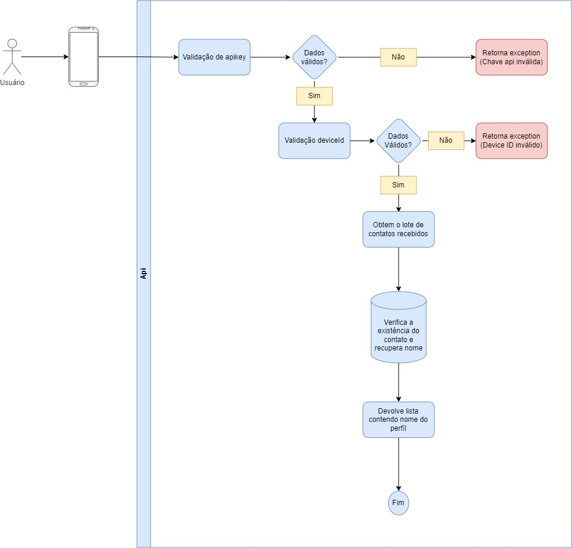

# api/v1/contacts (post)

Esse endpoint é usado para obter informações a respeito de contatos. 

    url: api/v1/contacts
    headers: device_id, x-api-key
    query param: code type: string
    return: refreshToken and accessToken
    body: {
      "phone",
      "phone"
    }
    
Retorna uma lista com os contatos na base

## Diagrama

  

