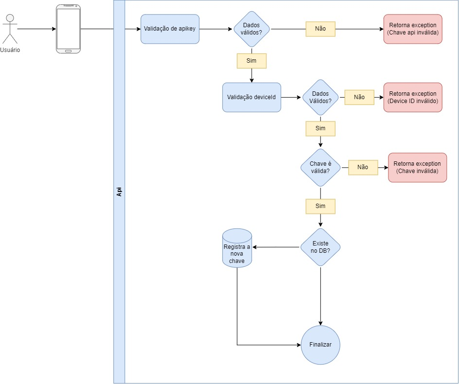

# api/v1/handshake (post)

Esse endpoint é usado no momento que é feita a primeira inicialização do app, a fim de enviar a chave de decriptografia dos dados da requisição

    url: api/v1/handshake
    headers: device_id, x-api-key
    body: key(regex para válidação)
    return: refreshToken and accessToken
    
Retorna **201** para sucesso e **400** para rejeitado.

## Diagrama

  

