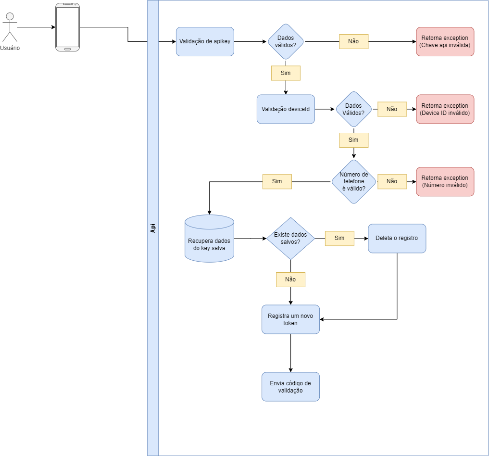

# api/v1/users/code (post)

Esse endpoint é usado no momento que é enviado as informações do telefone, para envio do código de validação.

    url: api/v1/users/code
    headers: device_id, x-api-key
    body: {
      "phone": "string"
    }

Retorna **201** para sucesso e **400** para rejeitado.

## Diagrama

  

