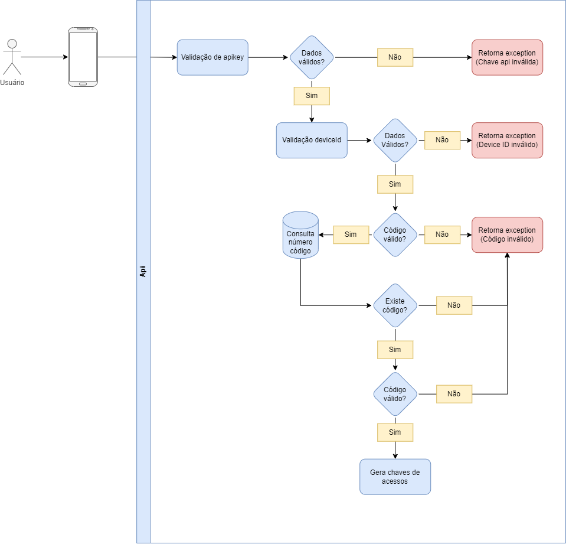

# api/v1/users/valid (get)

Esse endpoint é usado no momento que é realizado a validação do código, e feito com sucesso gerado os tokens de acessos.

    url: api/v1/users/valid
    headers: device_id, x-api-key
    query param: code type: string
    return: refreshToken and accessToken
    
Retorna **201** para sucesso e **400** para rejeitado.

## Diagrama

  

